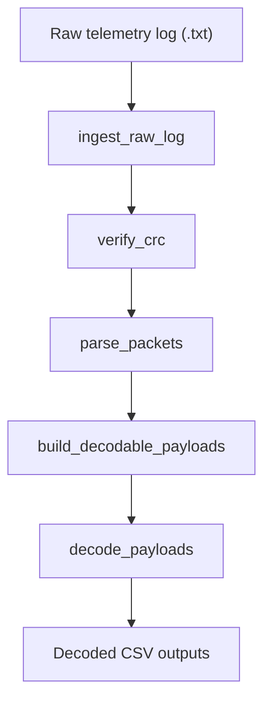

# S-band Decoder

This repository decodes S-band telemetry logs into structured decoded outputs.
The pipeline folders are named by responsibility instead of execution order so
the flow can change without forcing folder renames.

## Pipeline Flow



## Stages

| Stage | Folder | Purpose |
| --- | --- | --- |
| Ingest raw log | `pipeline/ingest_raw_log/` | Reads raw telemetry text, normalizes it, extracts timestamps, and builds timestamp-injected binary data. |
| Verify CRC | `pipeline/verify_crc/` | Splits packet-like binary data and keeps packets whose CRC is valid for the selected GSE format. |
| Parse packets | `pipeline/parse_packets/` | Converts verified packets into structured rows using packet structure JSON files from `config/`. |
| Build decodable payloads | `pipeline/build_decodable_payloads/` | Sorts packets, detects missing packets, reconstructs payload chunks, and writes intermediate decodable data. |
| Decode payloads | `pipeline/decode_payloads/` | Dispatches decodable chunks to the appropriate domain decoder and writes decoded CSV outputs. |

## Main Entry Point

`app/main.py` is the current orchestration entry point. Conceptually, it runs:

```python
timestamped_binary = build_timestamped_binary_from_log(path)
valid_binary = verify_crc(timestamped_binary, gse, file_name)
packets_df = parse_into_df(valid_binary, gse, file_name)
decodable_dir = process_decodable_df(packets_df, file_name)
decode.run(decodable_dir)
```

## Development Entries

Use the `dev/` scripts when developing or debugging one stage at a time. They
are thin wrappers around the real pipeline modules and print the next artifact
path after each run.

Run the full pipeline for one log:

```bash
python dev/run_pipeline.py tlm/example.txt
```

Run the full pipeline for every `.txt` file in a folder:

```bash
python dev/run_pipeline.py tlm/
```

Run individual stages:

```bash
python dev/run_ingest_raw_log.py tlm/example.txt
python dev/run_verify_crc.py data/intermediate_output/example/step1_timestamp_injected.bin
python dev/run_parse_packets.py data/intermediate_output/example/step2_valid_packets.bin
python dev/run_build_decodable_payloads.py data/intermediate_output/example/step3_decode_ready.csv
python dev/run_decode_payloads.py data/intermediate_output/example
```

All stage entries accept `--name` when you want to override the artifact folder
name. CRC and packet parsing entries also accept `--gse auto|ISAS|Kyutech`.

## Data And Config

- `tlm/`: raw telemetry log inputs.
- `data/intermediate_output/`: intermediate pipeline artifacts.
- `data/decoded/`: decoded CSV outputs.
- `config/`: packet structure definitions used during parsing.
- `decoder/`: domain-specific payload decoders used by `pipeline/decode_payloads/`.
- `tests/`: pytest test suite, organized to mirror pipeline responsibilities.

## Development Checks

Collect tests:

```bash
python -m pytest --collect-only -q
```

Run tests:

```bash
python -m pytest -q
```
