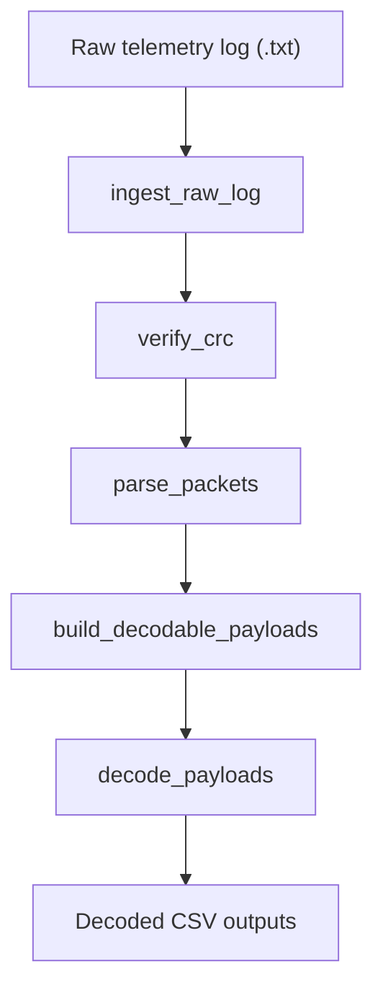

# Pipeline Flow

The folder names describe each stage's responsibility, not its fixed position
in the pipeline. If the execution order changes, update the orchestration in
`app/main.py` and this flow document rather than renaming packages again.
